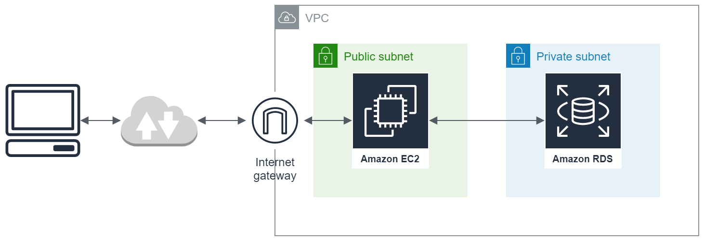

# bastion-tunnel to RDS
A bastion host to establish a ssh-tunnel to a private AWS VPC network which contains a RDS database. This is done via port forwarding from the bastion host to the database instance.



# Prerequisites
1. Terraform > v0.13
2. Node & NPM
    1. Gulp | ```npm i -g gulp```
    2. Typescript | ```npm i -g typescript```
    3. ts-node | ```npm i -g ts-node```
3. AWS Cli

# Instructions
0. Create .env file with the following variables (file is not tracked by git):
    1. TF_VAR_public_key=\<your-public-ssh-key>
    2. TF_VAR_developer=\<your-name>
    3. Optional: AWS_PROFILE=\<your-aws-profile>
2. Execute ```terraform apply```
3. Execute ```npm i```
4. Execute ```gulp bastion:tunnel```

Now a tunnel to your AWS VPC is established and you can connect to the RDS as if it is on your local machine:

    psql -h localhost -U postgres